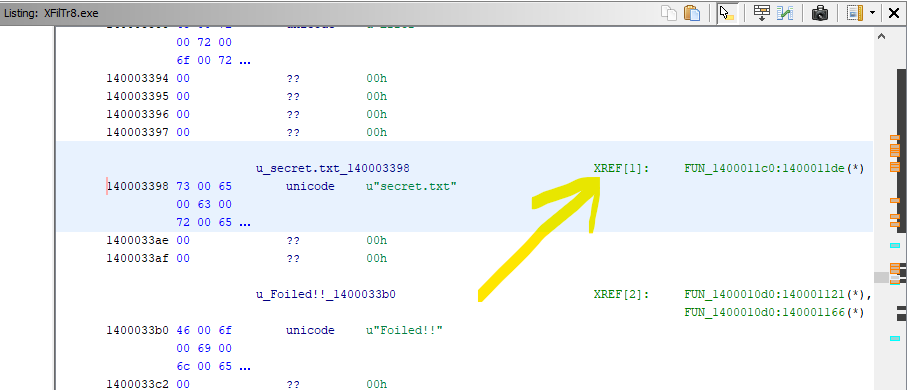

## Windows 10
1. Install 17 <= JDK(https://adoptium.net/) and make sure the bin file is in the Path environment variable

2. Unzip Ghidra package(https://github.com/NationalSecurityAgency/ghidra/archive/refs/heads/master.zip) and run "ghidraRun.bat"

# Important Tools:

## 1. Program Tree

    a. Navigation of sections of program 

 

## 2. Symbol Tree

    a. Contains known import, label, class, function, and namespace nomenclature used in the program

    b. More can be seen in Symbol Table and Symbol Reference Table if you want more data on symbol use

 

## 3. Listing

    a. Annotated Objdump with references and links to references built in

    b. Allows you to easily navigate to functions from hard coded data and vise versa

 

## 4. Decompiler

    a. Will show possible decompile of selected function's assembly into a pseudo-C language

 

## 5. Function Graph

    a. Breaks down function into different sections in its control flow and displays in flow chart

    b. Chart style has many options and you can manually move stuff around

    b. Makes conceptually understanding control flow of function very easy

 

## 6. Defined Strings

    a. List of all hard coded strings in program

    b. Very helpful to identify hard coded strings(Software\Microsoft\Windows\CurrentVersion\Run is common file string in malware)

 

## 7. Symbol Casting

    a. Right click any function, variable, or class in the binary or the decompile to rename for easier understanding

 

## 8. Function Call Graph

    a. lets you look at the hierarchy of calls to get to selected function and from a selected function

    b. Great for analyzing paths in a program

    c. There is also a Function Call Graph that will make a flow chart of this information 

 

## Putting it Together:

First I check the imported functions and uses with the Symbol Reference Table and see that CreateFileW is used along with Readfile

 

Then I go to Strings to see if there is any hardcoded filenames I could find... Bingo

 

I use listing to rename file 

 

and follow the reference

 

This takes me to an unknown function that Ghidra can decompile to better understand what is going on

 

This code is way easier to read than assembly(expecially compiler optimized) and you have many options from here including following the control flow for a deeper static analysis or using the new debugger with ghidra 10 to perform dynamic analysis on running malware.

I see ghidra as the VScode of the malware analysis world. Its open source, there are many different custom tools, and it is extremely customizable making it easy to use. This should be a common tool for any malware analyst, making much of the work streamline and efficient, plus Ghidra has a damn good decompiler for c code.