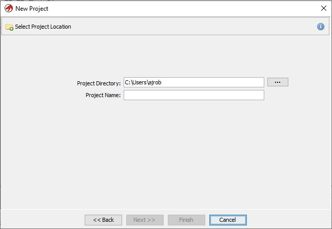
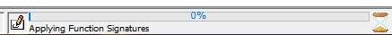

# Setup

## Windows 10

1. Install 17 <= JDK(https://adoptium.net/) and make sure the bin file is in the Path environment variable

2. Unzip Ghidra package(https://github.com/NationalSecurityAgency/ghidra/archive/refs/heads/master.zip) and run "ghidraRun.bat"

## Loading a Binary

1. When launching for the first time you'll come across this screen:
   

    Here we have an empty screen since no project is selected. So lets create a new project!

2. We can create a new project by hitting File, then hitting the New Project option in the menu.
   

3. Now that we've decided to create a new project, we must select a project type. Ghidra allows you to work on shared projects among multiple collaborators by choosing     the shared project option. In this case we'll be working solo, so we will select the Non-Shared Project option and hit next.
   

4. We've selected what type of project we want, so now we have to select where to store it, and what to name it.
   

   The location and name will/can vary but should look similar to this when filled out:
   Once filled out feel free to hit the finish button.
   

5. After hitting finish, you should be presented with a similar screen as seen in step one, but this time with some more options and an active project shown.
   

6. Our project is now created! Now we'll want to add a binary to examine. To do this we'll want to import a file. This can be achieved by hitting File, then selecting      the Import File option in the menu.
   

7. Once the import file option is selected, a file explorer window will appear, from there you will need to navigate to wherever your binary is located. Select the        binary by either double clicking the file, or by selecting the file and hitting the Select File to Import button
   

8. Once the binary is selected a new window should appear. This window has 4 fields: Format, which is the format type for the file i.e. ELF, PE, etc., Language, which    is the compiler Ghidra thinks was used to compile the binary. Destination Folder, which is the destination folder the binary is being imported to, and finally,        Program Name, which is the name of the file selected. You can either change these options to your liking or accept the pre-populated fields and hit OK
   

9. Once the OK button is hit, a loader should appear indicating hat the file is being imported into the project.
   

10. Once the import loader is finished you'll be brought to an import summary screen. This screen contains some information about the imported file. Once you're        satisfied with reading the results, you can hit the OK button.
    

11. After hitting OK you will be taken back to the screen seen in step 5, but now you should see your newly imported file!
    

12. Now at this point you probably want to do some analysis. Now you can! Either double click on the newly imported binary or select the binary and click the dragon icon and analysis can begin.

13. Once step 12 is completed you should now be at a screen similar to this:
    

    Unless you're in a rush to start looking at the file without Ghidra's analysis you'll want to hit Yes.

14. Upon hitting yes, you'll be taken to a screen with options you can select from for the analysis. Most are selected by default, but you can deselect or select to       your hearts content. Once your wanted options are selected hit Analyze.
    

15. Ghidra is now analyzing the file. In the bottom right hand corner, you should see a little loader bar to indicate it's analyzing the file. If you don't see a           loader don't worry, it may have just finished analyzing before you were finished reading this step!
    

16. Once that loader is gone, you should see a screen similar to this.
    

    Your binary is now fully ready to be analyzed!

# Important Tools:

## 1. Program Tree

    a. Navigation of sections of program 

 

## 2. Symbol Tree

    a. Contains known import, label, class, function, and namespace nomenclature used in the program

    b. More can be seen in Symbol Table and Symbol Reference Table if you want more data on symbol use

 

## 3. Listing

    a. Annotated Objdump with references and links to references built in

    b. Allows you to easily navigate to functions from hard coded data and vise versa

 

## 4. Decompiler

    a. Will show possible decompile of selected function's assembly into a pseudo-C language

 

## 5. Function Graph

    a. Breaks down function into different sections in its control flow and displays in flow chart

    b. Chart style has many options and you can manually move stuff around

    b. Makes conceptually understanding control flow of function very easy

 

## 6. Defined Strings

    a. List of all hard coded strings in program

    b. Very helpful to identify hard coded strings(Software\Microsoft\Windows\CurrentVersion\Run is common file string in malware)

 

## 7. Symbol Casting

    a. Right click any function, variable, or class in the binary or the decompile to rename for easier understanding

 

## 8. Function Call Graph

    a. lets you look at the hierarchy of calls to get to selected function and from a selected function

    b. Great for analyzing paths in a program

    c. There is also a Function Call Graph that will make a flow chart of this information 

 

## Putting it Together:

First I check the imported functions and uses with the Symbol Reference Table and see that CreateFileW is used along with Readfile

 

Then I go to Strings to see if there is any hardcoded filenames I could find... Bingo

 

I use listing to rename file 

 

and follow the reference

 

This takes me to an unknown function that Ghidra can decompile to better understand what is going on

 

This code is way easier to read than assembly(expecially compiler optimized) and you have many options from here including following the control flow for a deeper static analysis or using the new debugger with ghidra 10 to perform dynamic analysis on running malware.

I see ghidra as the VScode of the malware analysis world. Its open source, there are many different custom tools, and it is extremely customizable making it easy to use. This should be a common tool for any malware analyst, making much of the work streamline and efficient, plus Ghidra has a damn good decompiler for c code.
